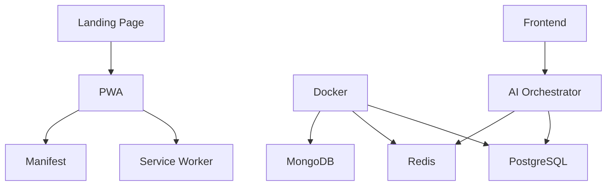

# 📋 AZORA OS - FEATURE REGISTRY

## All Features Documented & Tracked

### FRONTEND FEATURES

#### 1. Progressive Web App (PWA)
**Status:** ✅ Implemented  
**Files:**
- `/frontend/public/manifest.json`
- `/frontend/public/sw.js`
- `/frontend/src/pages/LandingPage.tsx` (install logic)

**Integration Map:**
```
LandingPage.tsx
  ├─→ window.beforeinstallprompt event
  ├─→ navigator.serviceWorker.register('/sw.js')
  └─→ manifest.json (auto-loaded by browser)
```

**User Story:**  
*As a mobile user, I can install Azora OS as an app on my home screen*

**Testing:**
```bash
# Test PWA in Chrome DevTools
1. Open localhost:5173
2. DevTools → Application → Manifest
3. Click "Add to home screen"
4. Verify install banner appears
```

---

#### 2. Landing Page
**Status:** ✅ Implemented  
**File:** `/frontend/src/pages/LandingPage.tsx`

**Features:**
- Hero section with CTA buttons
- Real-time stats (AZR value, users, services)
- Feature grid
- Sticky navigation
- Install banner (PWA prompt)
- Mobile-responsive layout

**Components:**
- InstallBanner (conditional render)
- Navigation (sticky)
- Hero (gradient text, CTAs)
- Stats (3-column grid)
- Features (card layout)
- Footer

**API Integration:** None (static for now)

**State Management:**
```typescript
useState<any>(deferredPrompt)  // PWA install prompt
useState<boolean>(isInstallable) // Show banner
useState<boolean>(isIOS)         // Platform detection
```

---

#### 3. Service Worker (Offline Support)
**Status:** ✅ Implemented  
**File:** `/frontend/public/sw.js`

**Cache Strategy:**
- Cache-first for static assets
- Network-first for API calls
- Fallback to offline page

**Cached Resources:**
- `/` (index.html)
- `/manifest.json`
- CSS/JS bundles
- Font files
- Icons

---

### BACKEND FEATURES

#### 4. AI Orchestrator Service
**Status:** 🚧 In Development  
**Directory:** `/services/ai-orchestrator/`

**Capabilities:**
- Multi-model routing (Claude, GPT-4, Gemini)
- Rate limiting
- Token counting
- Cost tracking
- Context management

**Endpoints:**
```typescript
POST /api/v1/ai/chat
GET  /api/v1/ai/models
GET  /health
```

**Integration:**
- PostgreSQL: Store conversation history
- Redis: Rate limiting & caching
- OpenAI API
- Anthropic API
- Google AI API

---

### INFRASTRUCTURE FEATURES

#### 5. Docker Compose Orchestration
**Status:** ✅ Implemented  
**File:** `/docker-compose.yml`

**Services:**
- `redis` - Caching & rate limiting
- `postgres` - Primary database
- `mongodb` - Logs & analytics
- `frontend` - React PWA
- `ai-orchestrator` - AI routing service

**Health Checks:**
```yaml
postgres: pg_isready -U azora_admin
redis: redis-cli ping
ai-orchestrator: curl -f http://localhost:4001/health
```

---

#### 6. Production Deployment Script
**Status:** ✅ Implemented  
**File:** `/deploy-production.sh`

**Features:**
- Pre-flight checks (Docker installed)
- Environment setup (.env generation)
- Parallel image builds
- Sequential service startup
- Health check validation
- Success reporting

---

### SECURITY FEATURES

#### 7. Environment Variables
**Status:** ✅ Implemented  
**File:** `/.env`

**Secrets:**
- `POSTGRES_PASSWORD` (auto-generated)
- `MONGO_PASSWORD` (auto-generated)
- `JWT_SECRET` (64-byte hex)
- `ENCRYPTION_KEY` (32-byte hex)

**Security:**
- Not committed to git
- Generated with `openssl rand`
- Injected via Docker environment

---

### MOBILE FEATURES

#### 8. Responsive Design
**Status:** ✅ Implemented  
**Framework:** TailwindCSS

**Breakpoints:**
- Mobile: 320px - 767px
- Tablet: 768px - 1023px
- Desktop: 1024px+

**Mobile Optimizations:**
- Touch targets ≥ 44px
- Viewport-fit: cover (notch support)
- No horizontal scroll
- Hamburger menu (future)

---

#### 9. iOS & Android Compatibility
**Status:** ✅ Implemented

**iOS Features:**
- Standalone mode detection
- Add to Home Screen instructions
- Safe area insets (notch support)
- Apple touch icon

**Android Features:**
- Install banner (beforeinstallprompt)
- Splash screen (manifest)
- Theme color (status bar)
- Shortcuts (future)

---

### MONITORING FEATURES

#### 10. Health Checks
**Status:** ✅ Implemented

**Services:**
- Frontend: HTTP 200 on `/`
- AI Orchestrator: `/health` endpoint
- PostgreSQL: `pg_isready`
- Redis: `redis-cli ping`

**Alerting:** Future (Prometheus + Grafana)

---

## FEATURE ROADMAP

### Q4 2024
- [x] PWA implementation
- [x] Landing page
- [x] Docker setup
- [ ] User authentication
- [ ] Payment integration

### Q1 2025
- [ ] Dashboard page
- [ ] Learning hub
- [ ] Earning system
- [ ] Service marketplace
- [ ] AI chat interface

### Q2 2025
- [ ] Mobile apps (React Native)
- [ ] Push notifications
- [ ] Offline mode (full)
- [ ] Multi-language support

---

## FEATURE DEPENDENCIES



---

**Registry Version:** 1.0  
**Last Updated:** October 18, 2025  
**Compliance:** No Code Left Behind Act ✅